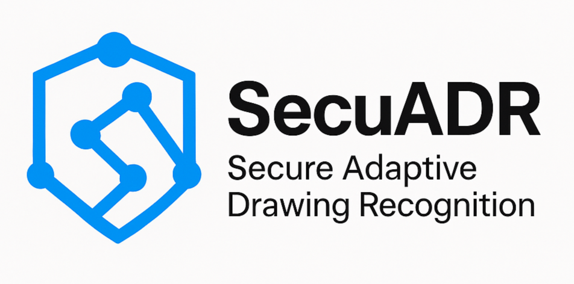
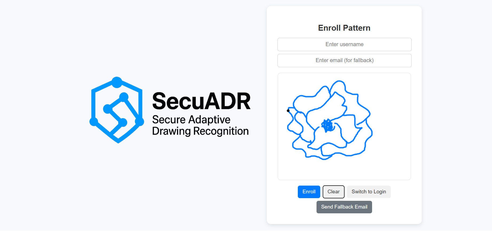

# 

# SecuADR


A gesture-based authentication system with a fallback email login feature, built using:

**Frontend:** React (Canvas-based pattern drawing)

**Backend:** Node.js + Express + MongoDB

**Fallback:** Secure email token for backup login

---

## ✅ Features

- **Pattern Enrollment:** Users draw and save a gesture as their password.
- **Pattern Login:** Authenticate by matching the stored gesture with high accuracy.
- **Fallback Login:** Send a time-limited token to email for passwordless access.
- **Secure:** Pattern stored in DB, token expires in 10 minutes, single-use.

---

## 🛠 Tech Stack

**Frontend:**

- React + react-canvas-draw for pattern capture
- Axios for API calls
- React Native (Expo) for mobile

**Backend:**

- Node.js + Express
- MongoDB (via Mongoose)
- Nodemailer for sending fallback email
- Dollar One Recognizer algorithm for gesture matching

**Mobile:**

- React Native (Expo)
- $1 Recognizer (custom implementation)

---

## 📂 Project Structure

```
SecuARD/
├── LICENSE
├── pattern-login/         # React frontend
│   ├── public/
│   ├── src/
│   │   ├── components/
│   │   │   └── PatternCanvas.jsx
│   │   └── utils/dollarOneRecognizer.js
│   └── package.json
├── server/                # Node.js backend
│   ├── routes/
│   │   ├── fallback.js           # Send fallback link
│   │   ├── fallback-auth.js      # Validate token & pattern
│   │   ├── save-pattern.js       # Save pattern
│   │   └── get-pattern.js        # Fetch saved pattern
│   ├── models/
│   │   ├── Pattern.js            # Stores username + pattern
│   │   └── Token.js              # Stores fallback tokens
│   ├── utils/mailer.js           # Nodemailer config
│   ├── index.js                  # Server entry point
│   └── .env                      # Env variables
├── secuadr-app/           # React Native mobile app
│   └── app/_layout.tsx    # Main Expo app file
└── ...
```

---

## ⚡ Setup & Installation

### 1. Clone the Repository

```sh
git clone https://github.com/Lumine8/SecuADR
cd SecuARD
```

### 2. Backend Setup

```sh
cd server
npm install
```

**Configure Environment**
Create a `.env` file in `server/`:

```ini
PORT=5000
MONGO_URI=mongodb://127.0.0.1:27017/patternLogin
EMAIL_USER=your_email@gmail.com
EMAIL_PASS=your_app_password   # Use Gmail App Password
```

**Run server:**

```sh
npm start
```

### 3. Frontend Setup

```sh
cd ../pattern-login
npm install
npm run dev
```

The frontend will be available at `http://localhost:5173` (default Vite port).

---

## 🔗 API Endpoints

| Method | Endpoint               | Description               |
| ------ | ---------------------- | ------------------------- |
| POST   | /api/save-pattern      | Save user pattern         |
| GET    | /api/get-pattern/:user | Get pattern for username  |
| POST   | /api/send-fallback     | Send fallback login email |
| POST   | /api/fallback-auth     | Validate token + pattern  |

---

## 🖼 Screenshots



- Pattern Enrollment UI
- Login Screen
- Fallback Email Example

---

## 📱 Mobile App

A React Native/Expo mobile app is available in `secuadr-app/`. It features:

- Pattern enrollment and login using touch gestures
- $1 Recognizer implementation in TypeScript
- Navigation between Register and Login screens

See `secuadr-app/app/_layout.tsx` for the main app logic.

---

## ✅ Features Completed

- ✔ Pattern enrollment & login
- ✔ Fallback token generation
- ✔ Email sending with token link
- ✔ Pattern matching via $1 recognizer

---

## 🚀 Upcoming

- Mobile App (React Native + Skia)
- JWT-based sessions
- UI Polish & Responsive Design
- Production Deployment

---

## 🤝 Contributing

See [CONTRIBUTING.md](./CONTRIBUTING.md) for guidelines. All contributions require prior written permission. Please open an issue to discuss proposals before submitting pull requests.

## 🛡 Security

If you discover a vulnerability, please follow the process in [SECURITY.md](./SECURITY.md). Do not open public issues for security matters—email sankargopan1@gmail.com for responsible disclosure.

---

## 📜 License

SecuADR is dual-licensed:

- **Proprietary License (Default):** This repository and its contents are the exclusive property of Lumine8. Any use, modification, or distribution without prior written permission is strictly prohibited.
- **MIT License:** Select components, utilities, or future OSS contributions may be licensed under MIT for open-source use. See [LICENSE-OSS.txt](./LICENSE-OSS.txt) for details.

For commercial or extended usage rights, please contact: sankargopan1@gmail.com
